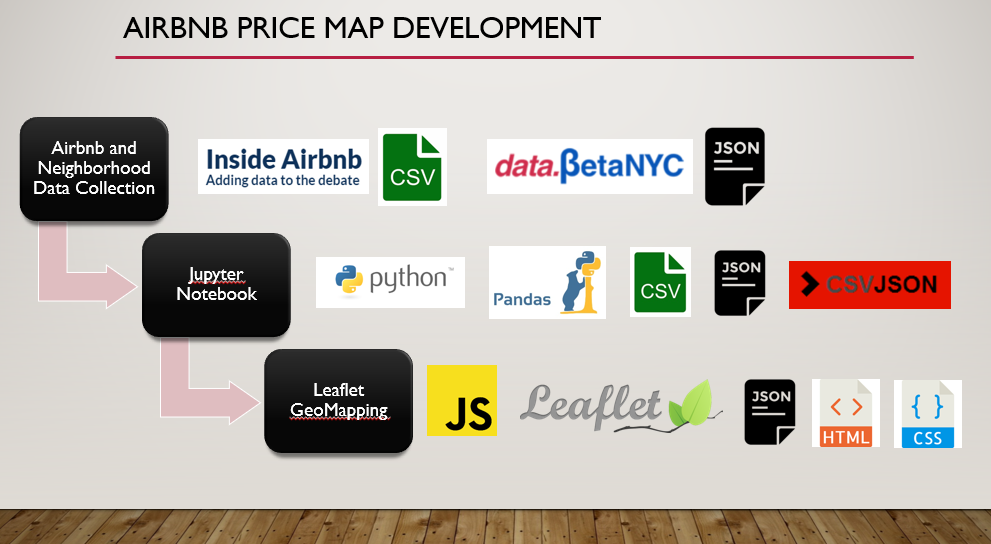
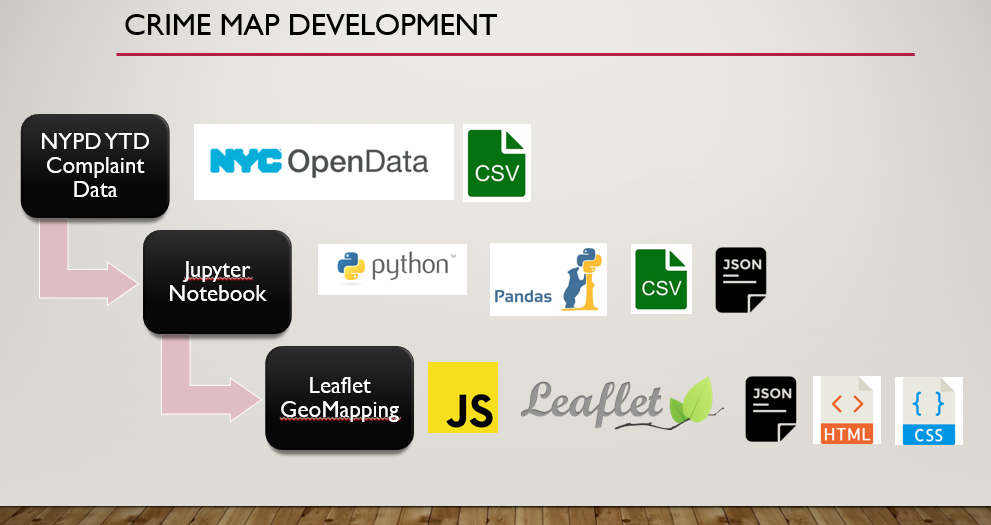
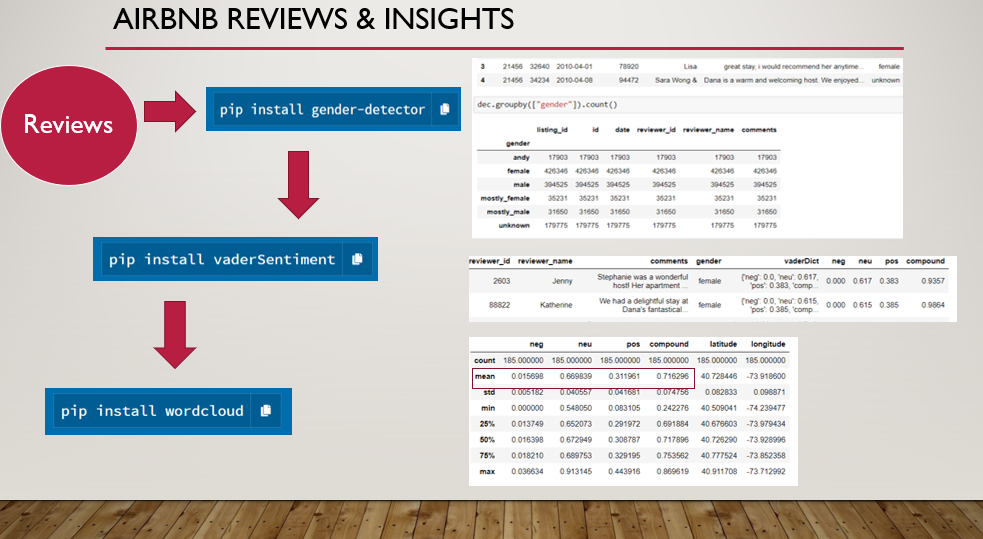

# KNOW-B4-U-GO
Have you ever stayed at an Airbnb?  
Did research on where you're staying before booking?   
Had to click through multiple different sites to find all the answers you were looking for?

That’s where Know-B4-U-Go comes in! Filling a whitespace in the market where you can go to one site and gain a holistic perspective of where you want to travel (Airbnb pricing by neighborhood, crime data, comments sentiment analysis, & where to eat).

Take a look at the beta-site here:  
 https://awish44.github.io/know_b4_u_go/
 
 Shoutout to my group: 
* [Maria-Jose Villacreses](https://github.com/mjvillacresesn)
* [Francis Wong](https://github.com/francisimperial )
* [Eric Lieu](https://github.com/elieu17)
 
## HTML Files:
[Here](index.html) is the code for the landing page and don't forget to check out the [style sheet](style.css)!

Links to code for all pages:
* [Pricing & Crime Map](map.html)
* [Restaurant & Bars Map (coming soon)](restaurant.html)
* [Insights Analysis](sentiment.html)

# Price & Crime Map
* View code [here](https://github.com/awish44/know_b4_u_go/tree/master/Price%20and%20Crime_Map/static/js)

## Insights Analysis:
* View code [here](https://github.com/awish44/know_b4_u_go/blob/master/Sentiment/2018-sentiment-concat.ipynb)

